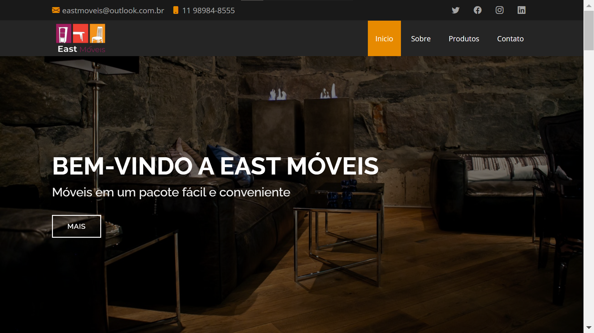
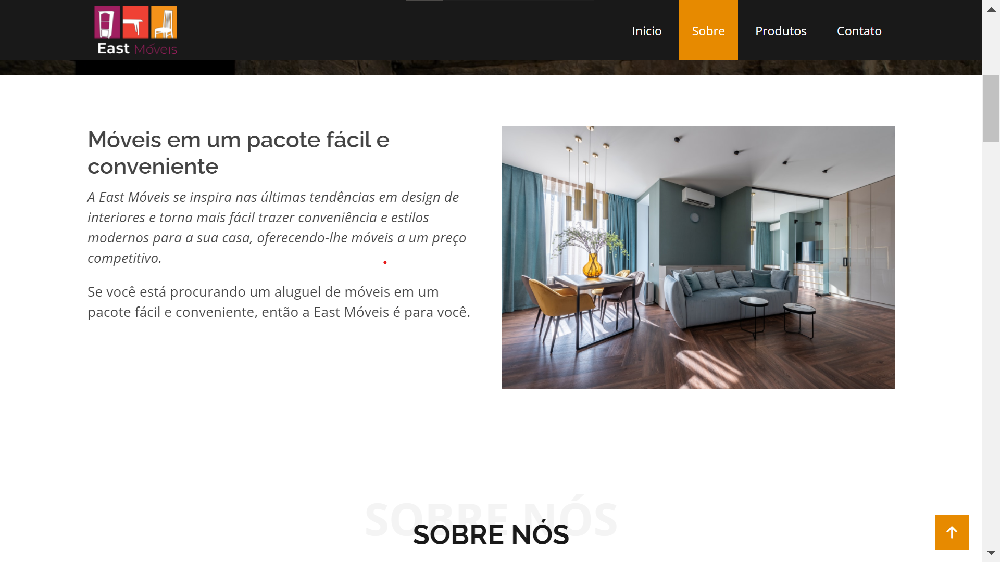

<h1 align="center">East Móveis</h1>

<h2 align="center">East Móveis</h2>

  <a href="#-Project">Projeto</a>&nbsp;&nbsp;&nbsp;|&nbsp;&nbsp;&nbsp;
  <!-- <a href="#hammer_and_wrench-Features">Features</a>&nbsp;&nbsp;&nbsp;|&nbsp;&nbsp;&nbsp; -->
  <a href="#-Technologies">Tecnologias</a>&nbsp;&nbsp;&nbsp;|&nbsp;&nbsp;&nbsp;
  <!-- <a href="#-How-to-execute">Como usar</a>&nbsp;&nbsp;&nbsp;|&nbsp;&nbsp;&nbsp; -->
  <a href="#-Licence">Licença</a>

  

##

<!-- <video src="./src/assets/App.mp4" width="100%" autoplay></video> -->

## 💻 Projeto

[East Móveis](https://eastmoveis.netlify.app) é um web site de exposição de móveis.

## ✨ Tecnologias

Este projeto foi desenvolvido com as tecnologias abaixo:

- [html](https://developer.mozilla.org/pt-BR/docs/Web/HTML)
- [CSS](https://developer.mozilla.org/pt-BR/docs/Web/CSS)
- [Javascript](https://developer.mozilla.org/pt-BR/docs/Web/JavaScript)
- [Bootstrap](https://getbootstrap.com/)
<!-- - [JSON Server](https://github.com/typicode/json-server)
- [Axios](https://axios-http.com) -->

## 📄 Licença

Este projeto está sob a licença MIT abaixo. Leia sobre [LICENSE](./LICENSE) para mais informações.

---
Veja aplicação [online](https://eastmoveis.netlify.app)

Desenvolvido por Samael Melo .
